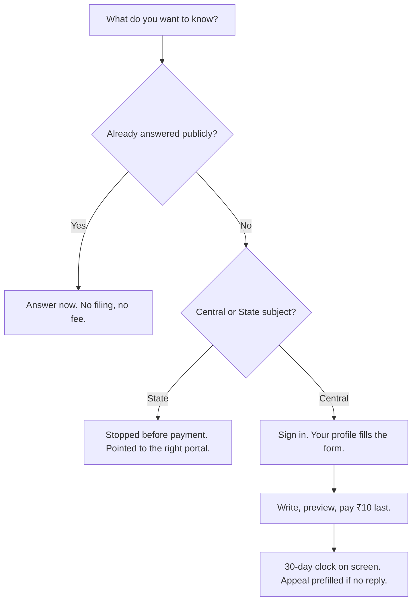

# RTI 3.0 — a rebuild of India's RTI Online portal

> **Unofficial prototype. Not a government service.** Not affiliated with, endorsed by
> or connected to the Government of India, DoPT or NIC. No State Emblem or government
> marks are used anywhere. Nothing filed here reaches any public authority.

---

## The problem

On [rtionline.gov.in](https://rtionline.gov.in), an RTI application can fail before
anybody reads it — wrong body, answer already public, question unanswerable as written —
**and the portal keeps the ₹10 fee anyway.** Scope is checked after payment, not before.

| The live portal | RTI 3.0 |
|---|---|
| Pays ₹10 first, checks scope afterwards — out-of-scope filings returned **without refund** | Everything that can fail is checked **before** the money |
| 2,916 public authorities in an alphabetical accordion — no search, no filter | The official list (94 ministries, 2,487 authorities) filtering as you type, with a shareable page per department |
| Request body accepts only `A-Z a-z 0-9` — no Indian script, on a portal that offers Hindi | Full Unicode in every field; write in any script you like |
| Filing date stored; the 30-day deadline is never computed or shown | Statutory clock computed and displayed, with the section of the Act it comes from |
| Tracking means pasting a registration number from an email | Sign in once — every request, deadline and appeal in one list |

### The journey, reordered



---

## What RTI 3.0 adds

### 1. Ask before you file — an AI assistant

**RTI Sahayak** is a chat on the first step: describe what you want to know in any Indian
language, and it suggests the right authority and a sharper way to ask. Three constraints,
all enforced in code:

- It **cannot invent an authority** — every suggestion is checked against the official list before it is shown.
- It is **never the only answer** — a deterministic keyword matcher runs alongside it, showing which of your own words produced the match.
- It **decides nothing irreversible** — nothing is filed and no money moves until you have read the application and pressed the button.

Without an API key the assistant reports itself unavailable and the keyword matcher
answers instead — the on-screen badge changes from `AI-assisted` to `Keyword matching`.

### 2. Answers that already exist, published

A browsable log of **already-processed requests and published material**. If what you
want is already public, you get it now — no filing, no fee, no 30-day wait. In
production this layer would index each authority's section-4 proactive disclosures and
previously released RTI replies; every question deflected here is ₹10 and 30 days saved
for the citizen and one fewer application in an officer's queue.

### 3. An account — because the identity check already exists

The live portal makes you re-enter your name, address, phone and the rest **on every
filing**, and it already sends an email OTP before letting you file — an identity check
with no benefit attached. RTI 3.0 completes that thought:

- **Type once.** Create a profile; every future filing is filled in from it. Change it whenever you like.
- **Sign in, don't hunt.** Tracking no longer requires pasting a registration number from an email — sign in and every request, deadline and appeal is in one list. Tracking by reference number is still there for one-off checks.
- **The account menu:** Dashboard · File a new request · Track status · History · File appeal · Payments · Profile.
- **BPL means no fee.** Answer the Below-Poverty-Line question in your profile and the payment step disappears, per section 7(5) of the Act.

And because an account around politically sensitive requests is a real trade-off, this
one stores as little as possible: an opaque cookie, a contact string, a 24-hour TTL. No
Aadhaar, no PAN, no passwords — and the page says so.

**Planned, not yet implemented:** Aadhaar-based identity verification for the account.
Until that change actually ships, this prototype collects no Aadhaar data and sign-in is
email or mobile plus a code — this line stays in the README so the gap is visible rather
than implied.

### Trying it: the demo account

Sign in with **Email `vish@abc.com`, password `Rti@2026`** (any password works; it is
discarded unread). The account belongs to a synthetic holder, Puneet Vishnawat, and
ships with eight invented requests covering every state the account screens can show:
in flight, running out, overdue and appealable, answered in full, answered in part,
refused under section 8(1)(j), appealed, and withdrawn. Anything you file yourself
appears alongside them for the session; the seeds themselves are read-only and live in
`src/data/demo-account.ts`.

### 4. A UI built for the citizen who actually uses it

The design constraint throughout: a budget Android phone on a 3G connection.

- **Works with JavaScript off.** Every step is a plain form posting to the server — the whole journey, search, filters and accessibility controls are tested with scripting disabled.
- **Accessible by target, not afterthought.** GIGW / WCAG 2.1 AA: every input labelled, 48px touch targets, visible focus, no colour-only signalling, nothing is an image of text.
- **Fast by subtraction.** Server-rendered HTML, almost no client JavaScript, no web fonts, no images — Indian scripts render from the system stack with nothing to download.
- **Real URLs everywhere** — filters, departments, cases — so results can be bookmarked or sent over WhatsApp, and the back button always works.

### 5. Every language of the Eighth Schedule

The switcher names **all 23 — English plus the Constitution's 22 Eighth Schedule
languages — in their own script.** Eleven are live today: English, Hindi, Bengali and
Marathi fully; seven more (Telugu, Tamil, Gujarati, Urdu, Kannada, Odia, Malayalam) cover
the first pages and fall back to English deeper in. The rest are listed visibly rather
than hidden, and adding one is a single JSON file plus one line of registration.
Right-to-left is honoured for Urdu, Kashmiri and Sindhi.

---

## What is mocked — labelled as mocked on screen

| Mocked | What that means |
|---|---|
| The ₹10 payment | No money moves. There is no card, UPI, bank or OTP field anywhere in this prototype. |
| The published-answers corpus | Synthetic records. No real document is reproduced. |
| Officer replies | Written by us, triggered by a labelled demo button. |
| Registration numbers | Correct shape (`AAAAA/R/E/YY/NNNNN`, from the portal's own manual), generated locally, meaningless outside. |
| The sign-in code | No code is generated or sent; entering any six digits signs you in. |
| The 30-day clock | A demo control moves a display-only date; stored timestamps never move, and the screen says both dates. |

---

## Verified, not asserted

```bash
npm run verify     # build + contrast + type scale + unit tests + the full Playwright suite
```

- Colour contrast is checked straight out of the stylesheet in both themes — the check cannot drift from the design.
- axe-core runs across the site, including high-contrast mode; zero violations to pass, and any console error fails the build.
- The seven-step journey is walked with JavaScript disabled.
- `npm run preview` runs the same journey against the real Cloudflare Workers runtime, not just the dev server.

---

## Running it

```bash
npm install
npm run dev          # http://localhost:3000 — zero configuration needed
```

```bash
npm run deploy       # builds with OpenNext and deploys to Cloudflare Workers
```

No Cloudflare account or KV namespace is needed to develop: drafts fall back to
in-memory storage, and the footer always says which driver is live. The assistant falls
back to keyword matching without an `OPENAI_API_KEY`.

---

## Credits

Designed, audited and built by **Puneet Vishnawat**
([pukrvi@gmail.com](mailto:pukrvi@gmail.com)).

Built from a read-only audit of the live portal on 22 August 2026 — 13 documented gaps,
75 observations, and a benchmark against WhatDoTheyKnow, FOIA.gov and Mexico's PNT.
Nothing was ever submitted to the live portal, no account was created there, and no bot
detection was circumvented. Central authority names are public record; the routing
keywords, corpus, copy and code are ours.
